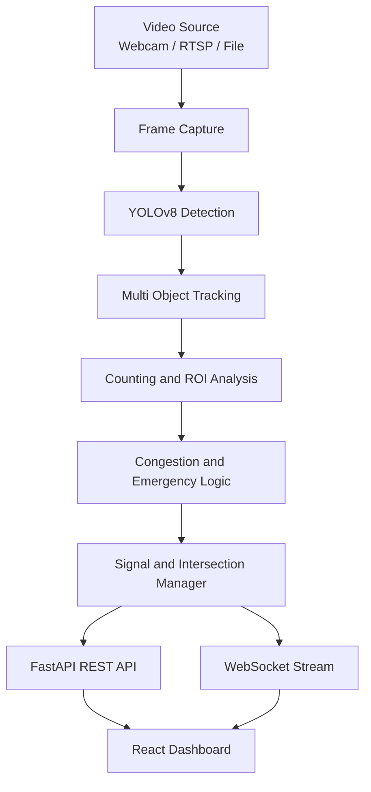
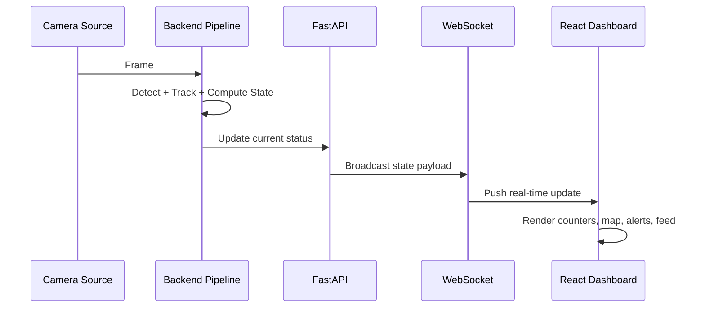

# AI Smart Traffic Monitoring and Emergency Priority System

<div align="center">


</div>

Production-ready, real-time traffic intelligence platform built with FastAPI, YOLOv8, WebSockets, and React.

The system performs live vehicle detection, congestion estimation, adaptive signaling, emergency-priority routing, and multi-panel visualization for traffic operations.

## Table of Contents

1. [Overview](#overview)
2. [Key Features](#key-features)
3. [Architecture](#architecture)
4. [Tech Stack](#tech-stack)
5. [Project Structure](#project-structure)
6. [Quick Start (Windows)](#quick-start-windows)
7. [Manual Setup](#manual-setup)
8. [Configuration](#configuration)
9. [API and WebSocket Reference](#api-and-websocket-reference)
10. [Data Model Snapshot](#data-model-snapshot)
11. [Operational Validation Checklist](#operational-validation-checklist)
12. [Performance and Tuning Notes](#performance-and-tuning-notes)
13. [Troubleshooting](#troubleshooting)
14. [Deployment Notes](#deployment-notes)
15. [Contributing](#contributing)
16. [Roadmap](#roadmap)
17. [License](#license)

## Highlights

- End-to-end real-time AI traffic monitoring stack
- Adaptive and emergency-aware signal strategy
- Streaming dashboard with map, camera, alerts, and analytics
- Windows-first local development workflow

## Overview

This project monitors urban traffic in real time using local computer vision and streaming telemetry.

Core flow:

1. Capture frames from webcam/RTSP/video source.
2. Run YOLOv8 detection and tracking.
3. Calculate lane-level and intersection-level load.
4. Trigger adaptive signal and emergency logic.
5. Publish updates via REST + WebSocket.
6. Render live dashboard panels (map, camera, alerts, environmental, solar).

Default location profile: Variety Square, Nagpur.

## Key Features

- Real-time vehicle detection and counting
- Congestion classification and live status updates
- Emergency mode and green-corridor support
- Multi-intersection network visualization
- ROI/lane-based signal timing logic
- Solar power telemetry simulation
- Environmental monitoring (AQI/noise) simulation
- Live alerts and severity breakdown
- WebSocket streaming with REST fallback in frontend
- Modular backend pipeline for extension and testing
- Ready-to-run Windows launch scripts for backend and frontend

## Architecture

### Pipeline Diagram (Mermaid)



### Operational Sequence (Mermaid)



### Text Fallback

```text
Video Source (Webcam/RTSP/File)
  -> Capture + Preprocess
  -> YOLOv8 Detection + Tracking
  -> Counting / Congestion / Emergency Analysis
  -> Signal + Intersection Management
  -> FastAPI REST + WebSocket Broadcasting
  -> React Dashboard (Maps, Camera, Alerts, Analytics)
```

## Tech Stack

Backend:

- Python 3.9+
- FastAPI + Uvicorn
- OpenCV
- Ultralytics YOLOv8
- WebSockets

Frontend:

- React 18 + Vite
- Tailwind CSS
- Google Maps (`@react-google-maps/api`)
- Leaflet / React-Leaflet
- Lucide icons

Deployment configuration files included:

- `backend/render.yaml`
- `backend/railway.json`
- `backend/Procfile`
- `frontend/netlify.toml`
- `frontend/vercel.json`

## Project Structure

```text
backend/
  api/
  config/
  core/
  logs/
  models/
  main.py

frontend/
  public/
  src/
    components/
    hooks/
  package.json

start-backend.bat
start-frontend.bat
README.md
```

## Quick Start (Windows)

### 1) Start backend

From workspace root:

```powershell
start-backend.bat
```

Backend runs on:

- API: http://127.0.0.1:8000
- WebSocket: ws://127.0.0.1:8000/ws/traffic
- Health: http://127.0.0.1:8000/health

### 2) Start frontend

From workspace root (new terminal):

```powershell
start-frontend.bat
```

Frontend runs on:

- http://localhost:3000

### 3) Verify backend health

```powershell
Invoke-WebRequest http://127.0.0.1:8000/health -UseBasicParsing
```

## Manual Setup

### Backend

```powershell
cd backend
python -m venv venv
.\venv\Scripts\activate
pip install -r requirements.txt
cd ..
python -m uvicorn backend.main:app --reload
```

Alternative startup (if your environment has import/lifespan issues):

```powershell
cd backend
venv\Scripts\python.exe -m uvicorn api.app:app --host 127.0.0.1 --port 8000 --lifespan off
```

### Frontend

```powershell
cd frontend
npm install
npm run dev
```

## Configuration

### Backend settings

Primary runtime settings are in `backend/config/settings.py`.

| Setting | Purpose | Default |
|---|---|---|
| `HOST` | Backend bind host | `0.0.0.0` |
| `PORT` | Backend port | `8000` |
| `VIDEO_SOURCE` | Camera index / RTSP / file path | `0` |
| `VIDEO_FPS` | Target capture FPS | `30` |
| `FRAME_WIDTH`, `FRAME_HEIGHT` | Capture resolution | `1280x720` |
| `YOLO_MODEL` | Model weight file | `yolov8n.pt` |
| `YOLO_CONFIDENCE` | Detection confidence threshold | `0.5` |
| `YOLO_IOU_THRESHOLD` | IoU threshold | `0.45` |
| `WEBSOCKET_UPDATE_INTERVAL` | WS broadcast interval (s) | `2.0` |
| `CONGESTION_LOW_THRESHOLD` | Lower congestion boundary | `10` |
| `CONGESTION_MEDIUM_THRESHOLD` | Medium congestion boundary | `20` |
| `AQI_ALERT_THRESHOLD` | AQI alert threshold | `150` |
| `NOISE_ALERT_THRESHOLD` | Noise alert threshold (dB) | `80.0` |

### Frontend environment variables

Create `frontend/.env` (or `.env.local`) when needed:

```bash
VITE_API_URL=http://127.0.0.1:8000
VITE_WS_URL=ws://127.0.0.1:8000/ws
VITE_GOOGLE_MAPS_API_KEY=YOUR_KEY_HERE
```

Notes:

- `VITE_WS_URL` is a base path (`.../ws`) and the client appends `/traffic`.
- The frontend normalizes `localhost` to `127.0.0.1` for more reliable local WS/API behavior on some Windows setups.
- If no Google Maps key is set, map components should still fail gracefully depending on component fallback logic.

## API and WebSocket Reference

### REST endpoints

- `GET /` - Service metadata and endpoint map
- `GET /health` - Runtime health and uptime
- `GET /traffic-status` - Current full traffic state
- `GET /stats` - Pipeline statistics
- `GET /config` - Runtime configuration snapshot
- `GET /intersections` - Intersection and corridor summary
- `GET /intersections/{intersection_id}` - Single intersection details
- `GET /solar-status` - Solar telemetry
- `GET /environmental` - Environmental telemetry
- `GET /alerts` - Active alerts and summary
- `POST /emergency/green-corridor` - Manual test trigger

Example request for manual corridor trigger:

```powershell
Invoke-RestMethod -Method Post -Uri "http://127.0.0.1:8000/emergency/green-corridor?start_id=variety_square&emergency_type=ambulance"
```

### WebSocket endpoints

- `/ws/traffic` - Live traffic state stream
- `/ws/stats` - Periodic statistics stream

Quick JavaScript WS example:

```javascript
const ws = new WebSocket("ws://127.0.0.1:8000/ws/traffic");

ws.onopen = () => {
  console.log("connected");
  ws.send("status");
};

ws.onmessage = (event) => {
  if (event.data === "ping") {
    ws.send("pong");
    return;
  }
  console.log("traffic payload", JSON.parse(event.data));
};
```

## Data Model Snapshot

Typical fields in traffic payloads (`/traffic-status` and `/ws/traffic`):

```json
{
  "cars": 0,
  "bikes": 0,
  "buses": 0,
  "trucks": 0,
  "ambulances": 0,
  "firebrigade": 0,
  "total": 0,
  "congestion": "LOW",
  "emergency_mode": false,
  "emergency_type": null,
  "area": "Variety Square, Nagpur",
  "lat": 21.1458,
  "lng": 79.0882,
  "lane_counts": {},
  "signal_times": {},
  "priority_lane": null,
  "intersections": [],
  "green_corridor": [],
  "solar_data": {},
  "environmental_data": {},
  "alerts": [],
  "alert_summary": {}
}
```

Depending on pipeline state, payload may also include a Base64 frame field.

## Operational Validation Checklist

Use this checklist after setup or before demo:

1. Backend starts without import/runtime errors.
2. `GET /health` returns `healthy` after initialization.
3. Frontend establishes WebSocket connection (`connected` status).
4. `GET /traffic-status` returns changing timestamps over time.
5. Vehicle counters update while camera/video source is active.
6. Congestion badge and map markers react to load changes.
7. Alerts tab displays generated system alerts.
8. Emergency trigger endpoint returns corridor activation payload.
9. Solar and environmental panels receive non-empty data objects.

## Performance and Tuning Notes

- Use `yolov8n.pt` for maximum real-time throughput on CPU.
- Reduce `FRAME_WIDTH`/`FRAME_HEIGHT` if FPS drops on low-end machines.
- Increase `WEBSOCKET_UPDATE_INTERVAL` to reduce frontend update pressure.
- For GPU systems, tune YOLO model size and confidence thresholds for balance between recall and speed.
- Keep capture source stable (avoid frequent source switching) for smoother tracker behavior.
- Prefer one backend process per camera source profile unless you introduce source multiplexing.

## Troubleshooting

### Camera not opening (Windows)

- Close apps that may lock the webcam.
- Try changing `VIDEO_SOURCE` in `backend/config/settings.py` from `0` to `1`.
- Use RTSP or file input as fallback.

### Backend reachable but dashboard shows disconnected

- Confirm `GET /health` returns healthy.
- Ensure frontend points to `127.0.0.1` (not `localhost`) for API/WS where possible.
- Verify:
  - `VITE_API_URL=http://127.0.0.1:8000`
  - `VITE_WS_URL=ws://127.0.0.1:8000/ws`

### YOLO model issues

- Ensure `ultralytics`, `torch`, and `opencv-python` are installed.
- Keep `yolov8n.pt` under `backend/` (or allow first-run auto-download).

### WebSocket opens but no live updates

- Check that pipeline startup completed and `GET /traffic-status` is not static.
- Ensure `WEBSOCKET_UPDATE_INTERVAL` is reasonable (for example `2.0`).
- Confirm browser console is not showing repeated JSON parse errors.

### Frontend shows empty map or map errors

- Verify `VITE_GOOGLE_MAPS_API_KEY` is set correctly when using Google Maps components.
- Restart Vite server after editing `.env` files.
- Check browser console network tab for blocked Maps script loads.

### Port conflict

Run backend on another port:

```powershell
python -m uvicorn backend.main:app --reload --port 8001
```

Then update frontend env accordingly.

## Deployment Notes

The repository includes deployment hints/config files for platforms such as Railway, Render, Netlify, and Vercel.

Before production deployment:

- Restrict CORS to trusted origins
- Add authentication/authorization for control endpoints
- Use TLS and reverse proxy
- Add structured logging and monitoring
- Configure process management and restart policy
- Tune model/device settings for target hardware

Recommended backend production command example:

```powershell
python -m uvicorn backend.main:app --host 0.0.0.0 --port 8000 --workers 1
```

Note: keep workers at `1` unless you redesign shared in-memory pipeline state for multi-worker safety.

## Contributing

Contributions are welcome for:

- Model and tracking quality improvements
- Intersection policy logic and emergency routing enhancements
- Dashboard UX and analytics modules
- Test automation and CI hardening

Suggested workflow:

1. Fork and create a feature branch.
2. Keep commits focused and descriptive.
3. Test backend + frontend locally before PR.
4. Open a PR with a clear problem statement and screenshots/logs when relevant.

## Roadmap

- Persistent storage for traffic history and alerts
- Role-based control/ops panel
- Policy engine for manual signal overrides
- Replay mode for incident analysis
- CI test coverage for backend pipelines and frontend integration

## License

Educational and prototype use.
